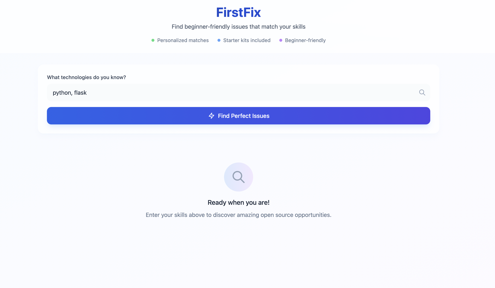

# 🤖 GitHub Issue AI Assistant



An **AI-powered assistant** that helps developers tackle GitHub issues faster.  
Given a repository and an issue, the system automatically:

- Fetches and chunks relevant code files 📂
- Indexes them into a vector database ⚡
- Uses an LLM to generate **Hints & Ideas** 💡
- Guides contributors on **where to work, what to change, and how to verify** ✅

Perfect for **open-source contributors, onboarding engineers, and developers** who want to ramp up quickly on unfamiliar codebases.

---

## ✨ Features

- 🔍 **Skill-based Search** – find repos/issues by tech stack (`python`, `flask`, `aws`, etc.)
- 📦 **Repo Context Packing** – fetches and chunks repo files intelligently (with character budget)
- 🧠 **LLM Hints & Ideas** – actionable suggestions on solving issues
- 🎯 **Scoping Guidance** – helps contributors keep changes focused
- 🖥️ **Interactive Dashboard** – clean frontend for exploring issues

---

## 🛠️ Tech Stack

- **Frontend**: React + TypeScript + TailwindCSS  
- **Backend**: Flask (Python)  
- **Vector DB**: ChromaDB  
- **LLM**: OpenAI (configurable model)  
- **Deployment**: Fly.io / Railway / Render  

---

## 🚀 Getting Started

### 1️⃣ Clone the repo
```bash
git clone https://github.com/your-username/github-issue-ai-assistant.git
cd github-issue-ai-assistant
```

### Backend Repo
```bash
https://github.com/Sakshamyadav19/fastfixbackend
```
